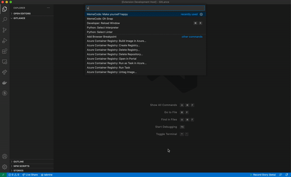
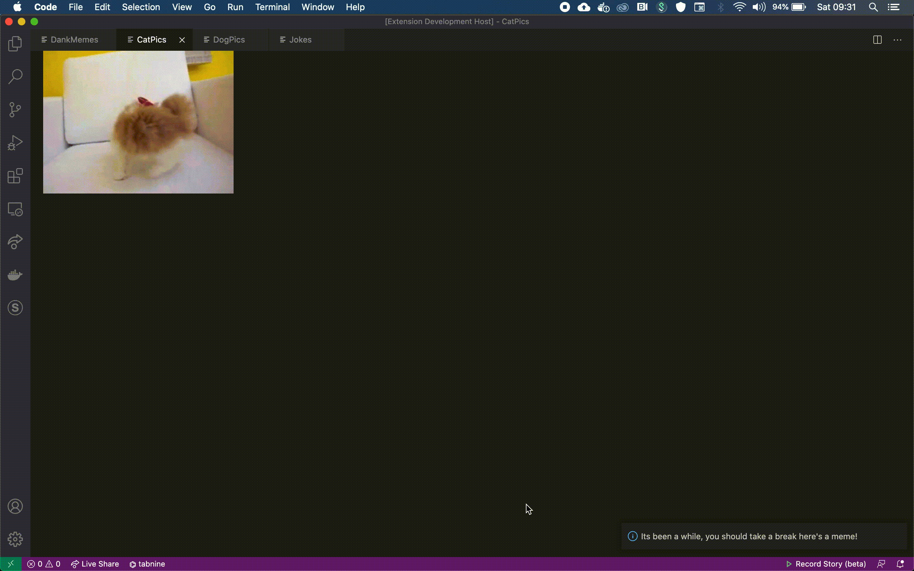
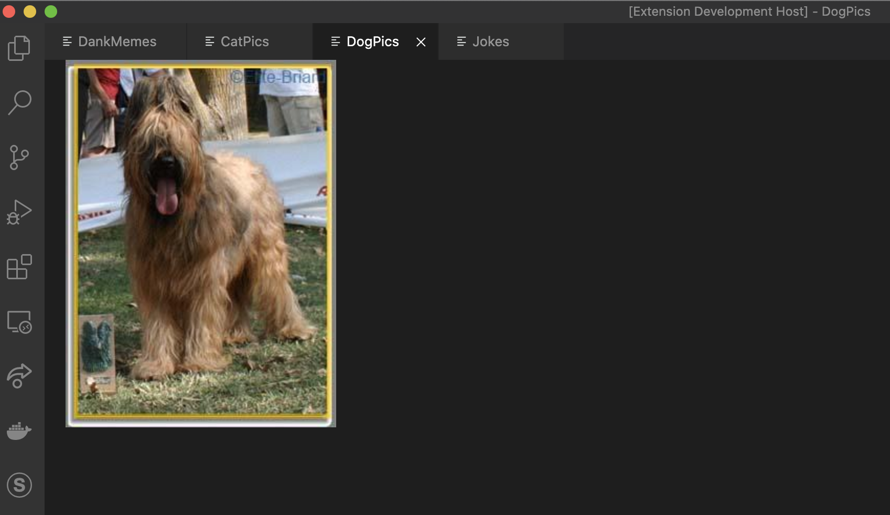
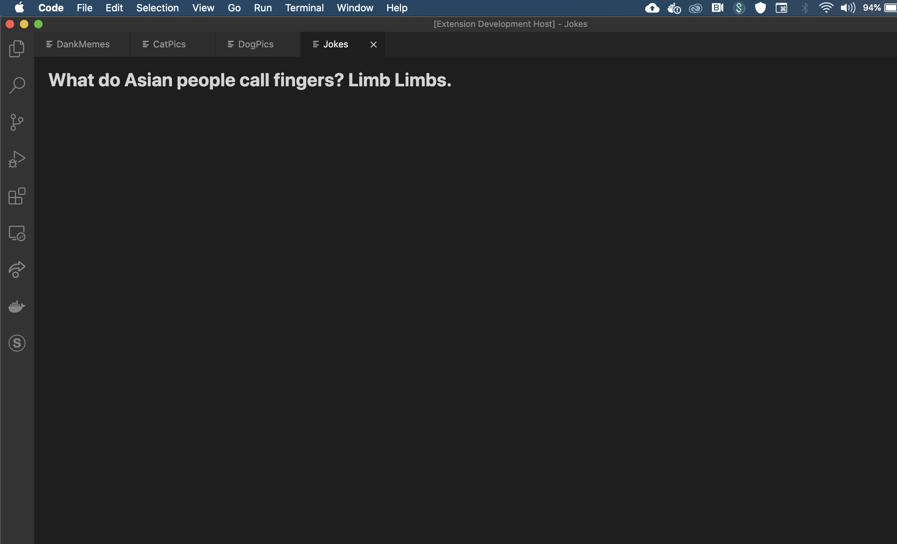
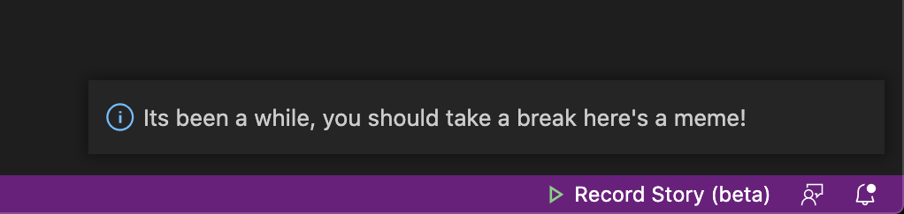

# MSMemeCode

Does coding tire you out or stress you out? Fan of memes? If yes then this extension is definitely for you!

## Usage

1. Open current repository with VS Code
2. Click the F5 button to run the plugin on a separate VSCode host
3. Open the command palette and search for MemeCode to find the following commands.
4. Voila it works!

## Here's a meme

Deeply in the midst of writing some intense logic but want a quick break just use the vscode app to see a dank meme, a cute cat or dog or find a new Joke to tell your friends.

### DANK Meme

### CUTE Cat

### DOGGo

### For the lolz

## Reminded Meme time

Never forget to get your hourly meme content, you can choose to periodically receive memes to keep your creative juices running

## Oh snap

Wanted to troll a friend, then this plugin is perfectly balanced as all things should be

WARNING: USE THIS AT YOUR OWN CAUTION

## Dream linter

Ever wondered if you're code is right? worry not the meme... dream linter is here to save your coding tasks. Simply enable it and you'll never make a mistake again!

